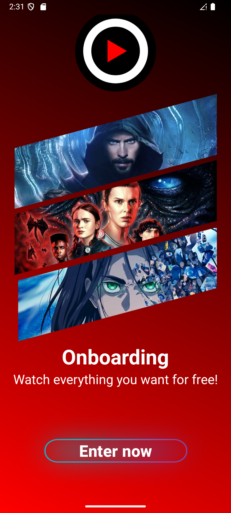
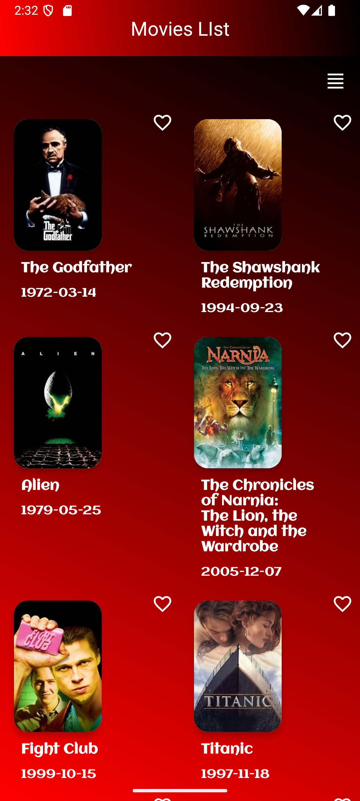

# Movie App

A modern Android application for browsing popular movies using the TMDb API.
The app allows users to view a list of movies, toggle between list and grid layouts, 
mark movies as favorites, and view detailed information about each movie. 
It supports offline mode and handles network connectivity gracefully.

## Features

- **Movies List**: Displays a paginated list of popular movies fetched from TMDb API.
- **List/Grid Toggle**: Switch between list and grid layouts for movie display.
- **Favorites**: Mark/unmark movies as favorites, stored locally using Room.
- **Movie Details**: View detailed information about a selected movie.
- **Offline Support**: Displays cached movies when offline and shows appropriate notifications.
- **Navigation**: Seamless navigation between screens using Android Navigation Component.
- **Error Handling**: Displays errors via Snackbar for network issues or API failures.

## Screenshots

Below are screenshots showcasing the app's user interface:

| **Splash Screen**| **Movies List** | **Movie Details** |
|-----------------------------------------|----------------------------|-------------------|
|  |  |  |
| Onboarding Screen.| Shows movies in a grid layout for a compact view. | Detailed view of a selected movie with favorite toggle. |

## Tech Stack

- **Language**: Kotlin
- **Architecture**: MVI (Model-View-Intent)
- **UI**: XML with View Binding
- **Asynchronous Programming**: Coroutines + Flow
- **Paging**: Paging 3 for efficient data loading
- **Local Database**: Room for storing favorite movies
- **Dependency Injection**: Koin
- **Networking**: Retrofit, OkHttp
- **Image Loading**: Glide
- **Navigation**: Android Navigation Component
- **Testing**: JUnit, Mockito, Coroutines Test

## Prerequisites

- Android Studio (latest version recommended)
- Android SDK (API 24 or higher)
- TMDb API Key (sign up at [TMDb](https://www.themoviedb.org/))

## Setup Instructions

1. **Clone the Repository**:
   ```bash
   git clone https://github.com/ARabie25/Movies-App
   cd Movies-App


## Add TMDb API Key:

Create a local.properties file in the project root (if not already present).
Add your TMDb API key:tmdb_api_key=your_api_key_here


## Sync and Build:

Open the project in Android Studio.
Click "Sync Project with Gradle Files".
Build the project (Build > Make Project).


## Run the App:

Connect an Android device or use an emulator.
Click "Run" to launch the app.


## Project Structure
    **movie-app/**:
    ```bash
    ├── app/
    │   ├── src/
    │   │   ├── main/
    │   │   │   ├── java/com/example/movieapp/
    │   │   │   │   ├── App/               # Application class
    │   │   │   │   ├── data/              # API, database, repository
    │   │   │   │   ├── di/                # Koin dependency injection
    │   │   │   │   ├── domain/            # Use cases, models
    │   │   │   │   ├── ui/                # Fragments, ViewModels
    │   │   │   │   ├── helper/            # Base classes (e.g., BaseFragment)
    │   │   │   ├── res/                   # Layouts, drawables, strings
    │   │   ├── test/                      # Unit tests

## Key Components

MoviesListFragment: Displays a paginated list of movies with list/grid toggle.
MovieDetailsFragment: Shows detailed movie information.
MoviesViewModel: Manages UI state and intents for the movie list.
MovieRepositoryImpl: Handles data operations (API calls, database).
TmdbApi: Retrofit interface for TMDb API.
AppDatabase: Room database for favorite movies.
KoinModule: Dependency injection setup.

## Testing
The project includes unit tests for MoviesViewModel and MovieRepositoryImpl. To run tests:
./gradlew test

## Tests cover:

Fetching movies (online/offline scenarios)
Toggling list/grid layout
Adding/removing favorites
Error handling

## Known Issues

Ensure a valid TMDb API key is provided in local.properties, or the app will throw an error.
Offline mode relies on cached data; ensure initial data fetch occurs online.
